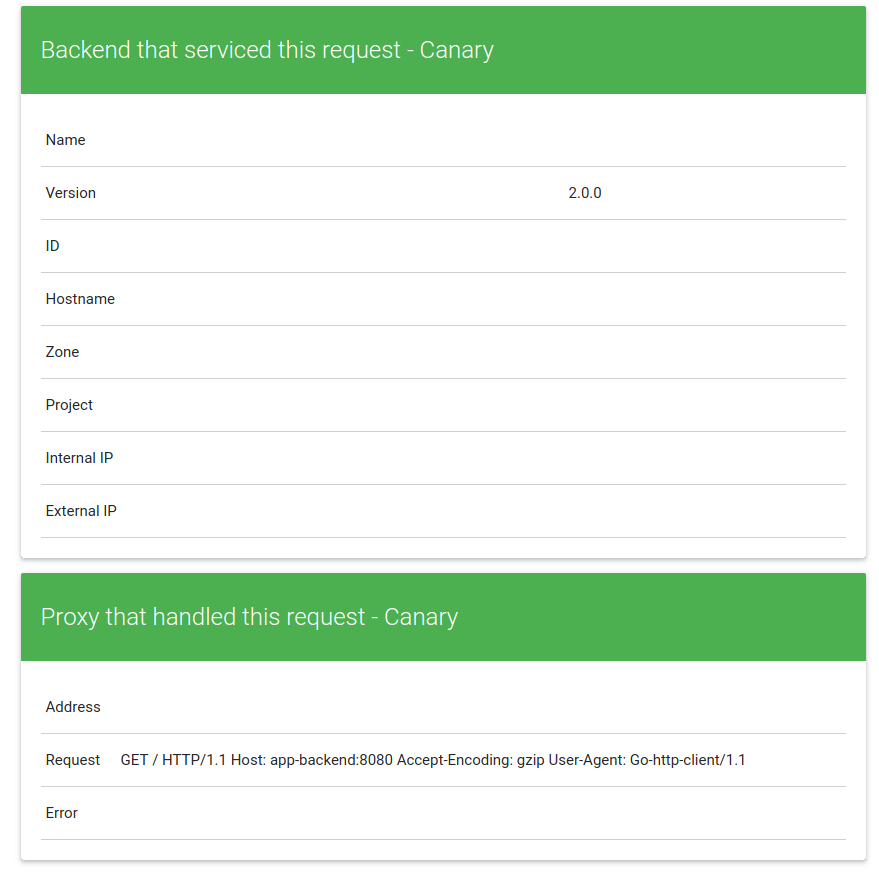
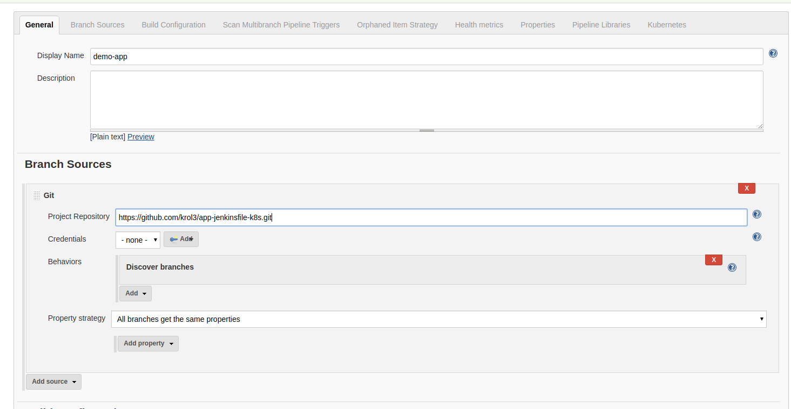

# Sample scalable Application using a canary deployment, Helm and Kubernetes

Dev, stage and production environments with canary deployment.

- Golang
- Backend: ./app
- frontend: ./app -frontend=true -backend-service=http://backend:8080 -port=8085
- Jenkinsfile
- Kubernetes deployments

#### Production Service


#### Canary Service



## Settings kubernetes cluster and Jenkins

[Setting kubernetes, helm and jenkins ... more details](k8s-settings/README.md)

## Deploy using minikube

We will test using minikube
`minikube start`

- Install CI: Jenknis
  `make jenkins-install`

  User: admin
  Password: `printf $(kubectl get secret --namespace ci j-v1-jenkins -o jsonpath="{.data.jenkins-admin-password}" | base64 --decode);echo`

- Create Job (future work: Initialize job by groove)
  Configure a multibranch pipeline
  

````

$ kubectl create namespace production
$ kubectl create namespace stage
$ kubectl --namespace=production apply -f k8s/production
$ kubectl --namespace=production apply -f k8s/canary
\$ kubectl --namespace=production apply -f k8s/services

```

#### Environments isolate by namespaces in kubernetes


## Scale the production service

```

kubectl --namespace=production autoscale deployment app-frontend-production --min=2 --max=5 --cpu-percent=80

deployment.apps "app-frontend-production" autoscaled

```

#### Information about the Horizontal pod autoscaler

```

kubectl --namespace=production get hpa

```


#### Canary deployment in kubernetes


## Job - Multibranch pipeline


#### Pipeline jenkins


```
````
