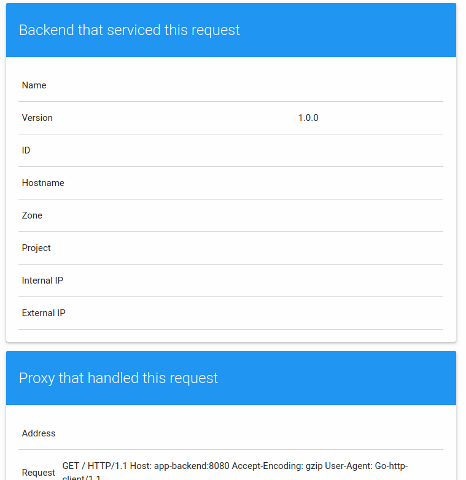
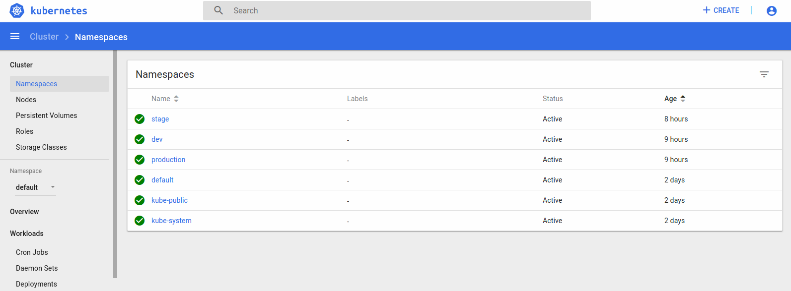
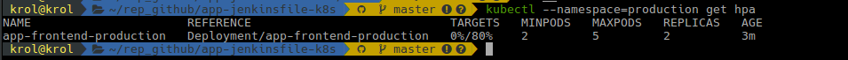
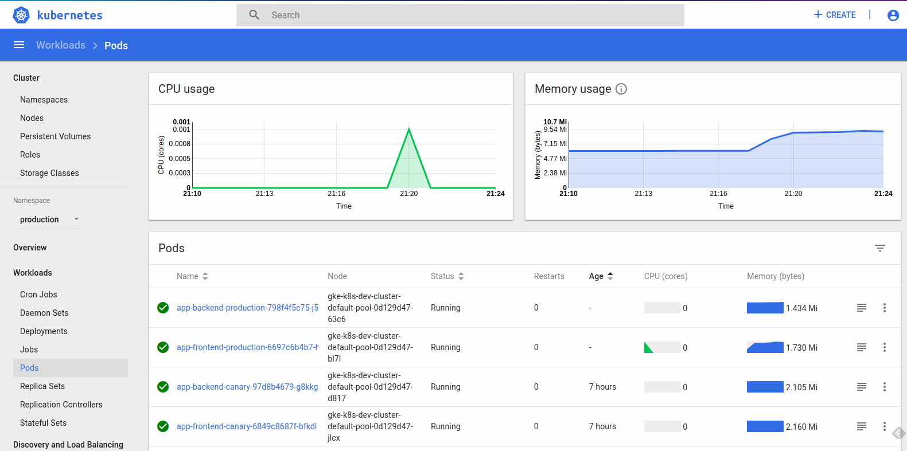
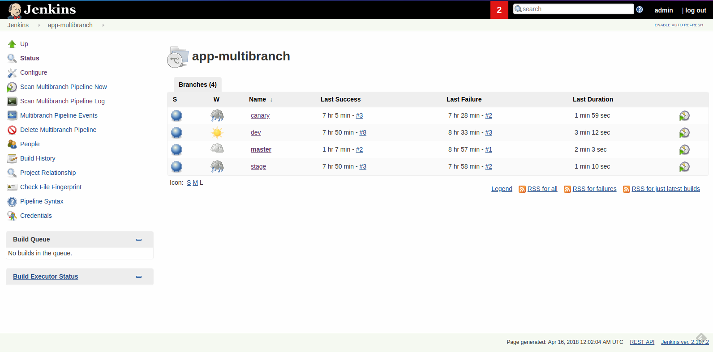
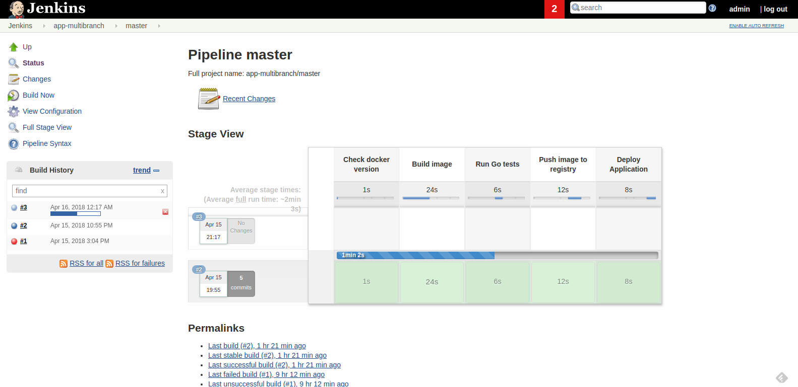

# Sample scalable application using a deployment pipeline, helm and kubernetes

Dev, stage and production environments with canary deployment.

- Golang
- Backend:  ./app
- frontend: ./app -frontend=true -backend-service=http://backend:8080 -port=8085
- Jenkinsfile
- Kubernetes deployments



## Settings kubernetes cluster and Jenkins
[Setting kubernetes, helm and jenkins](k8s-settings/README.md)

## Deploy applications in kubernetes

```
$ kubectl create namespace production
$ kubectl create namespace stage
$ kubectl --namespace=production apply -f k8s/production
$ kubectl --namespace=production apply -f k8s/canary
$ kubectl --namespace=production apply -f k8s/services
```

Environments isolate by namespaces in kubernetes



## Scale the production service

```
kubectl --namespace=production autoscale deployment app-frontend-production --min=2 --max=5 --cpu-percent=80

deployment.apps "app-frontend-production" autoscaled

```

Information about the Horizontal pod autoscaler

```
kubectl --namespace=production get hpa
```



Canary deployment in kubernetes



## Job - Multibranch pipeline



Pipeline jenkins

